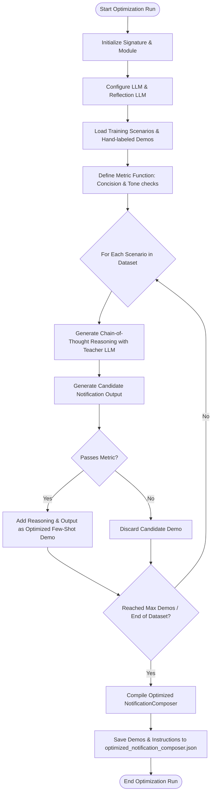
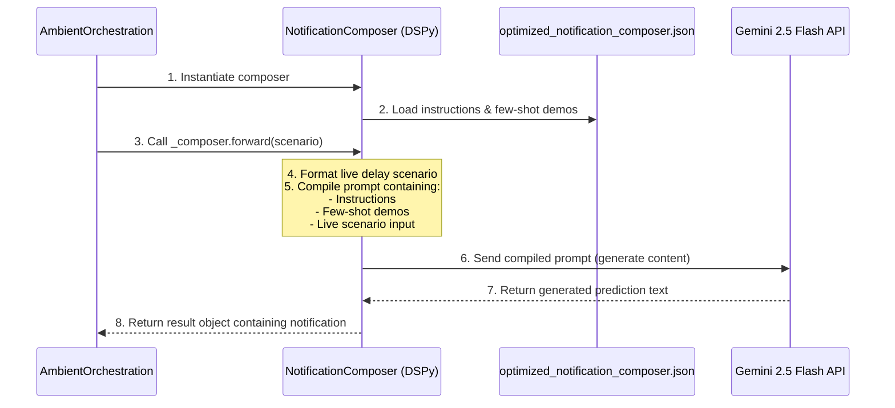

# DSPy Optimization and Inference Guide

This guide details how the travel delay notification composer is optimized (trained) using **DSPy**, how the output is serialized, and how the program executes inference at runtime inside the `AmbientOrchestration` loop.

---

## 1. Architecture Overview

DSPy separates the **logic of your program** (signatures and modules) from the **prompt engineering / weights** (few-shot demonstrations).

### Visual Architecture Flow
```text
  ┌────────────────────────────────────────────────────────┐
  │         PHASE 1: OPTIMIZATION (dspyoptimizer.py)       │
  │                                                        │
  │   [Define Signature] ──► [Load Trainset & Metric]      │
  │                                   │                    │
  │                                   ▼                    │
  │               [BootstrapFewShot Optimization Loop]     │
  │                                   │                    │
  │                                   ▼                    │
  │                 [optimized_notification_composer.json] │
  └───────────────────────────────────┬────────────────────┘
                                      │ (Serialized State)
                                      ▼
  ┌────────────────────────────────────────────────────────┐
  │         PHASE 2: RUNTIME INFERENCE (Orchestrator)      │
  │                                                        │
  │               [Load JSON State into Module]            │
  │                                   │                    │
  │                                   ▼                    │
  │               [Compile Prompt (Demos + Live Input)]    │
  │                                   │                    │
  │                                   ▼                    │
  │               [Query Active LLM: Gemini 2.5 Flash]     │
  │                                   │                    │
  │                                   ▼                    │
  │                 [Extract & Output Notification]        │
  └────────────────────────────────────────────────────────┘
```

*(Mermaid source code for visualization tool support)*
```mermaid
flowchart TD
    subgraph Phase 1: Optimization (dspyoptimizer.py)
        A[Define Signature & Module] --> B[Load Dataset & Metric]
        B --> C[BootstrapFewShot Teleprompter]
        C --> D[Run Optimization with Teacher LLM]
        D --> E[Save compiled state to optimized_notification_composer.json]
    end

    subgraph Phase 2: Inference (AmbientOrchestration.py)
        E --> F[Load JSON State into Module]
        F --> G[Construct Prompt with Demos + Live Scenario]
        G --> H[Query Active LM: Gemini 2.5 Flash]
        H --> I[Extract & Parse notification field]
    end
```

---

## 2. Phase 1: The DSPy Optimizer (`dspyoptimizer.py`)

During the optimization phase, DSPy executes the following steps to build the optimal prompt template:

1. **Defines a Signature (`NotificationSignature`):** 
   Specifies the inputs (`delay_scenario` as a JSON-like string) and output format (`notification` under 120 words).
2. **Defines a Module (`NotificationComposer`):** 
   Wraps the signature in a `dspy.ChainOfThought` pipeline.
3. **Applies a Teleprompter (`BootstrapFewShot`):** 
   * It takes a training set of scenarios.
   * It uses a teacher model (`gpt-oss-20b`) to generate candidate reasoning chains and notification outputs.
   * It evaluates outputs using a validation metric (checking conciseness and tone).
   * It keeps only the best-performing examples ("demos").
4. **Serialization:** 
   The selected few-shot demonstrations and prompt instruction schemas are saved into `optimized_notification_composer.json`.

### 2.1 Detailed Compilation & Optimization Loop

Here is the exact algorithmic flow executed during the compilation run of `dspyoptimizer.py`:

```text
  [Start Run] ──► [Init Module/Signature] ──► [Config LLMs]
                                                     │
  ┌──────────────────────────────────────────────────┘
  ▼
  [Load Dataset & Metrics]
         │
         ▼
  [For Each Scenario in Dataset]
         │
         ├──► [Generate CoT Reasoning & Candidate Output (Teacher LLM)]
         │                               │
         │                               ▼
         │                     [Evaluate via Metric]
         │                               │
         │                   ┌───────────┴───────────┐
         │                   │ (Pass)                │ (Fail)
         │                   ▼                       ▼
         │             [Add to Demos]            [Discard]
         │                   │                       │
         │                   └───────────┬───────────┘
         │                               ▼
         └───────────── [Check: All Scenarios Checked?]
                                         │
                                         ▼ (Yes)
                               [Save Compiled JSON] ──► [End Run]
```

*(Mermaid source code for visualization tool support)*


---

## 3. Phase 2: Runtime Inference (`AmbientOrchestration.py`)

At inference time, the saved JSON is loaded to generate the email/notification body dynamically:

```text
  Orchestrator               Composer (DSPy)             Active Gemini API
       │                            │                            │
       │─── 1. Load JSON State ────►│                            │
       │                            │                            │
       │─── 2. Call forward() ─────►│                            │
       │    (with Live Scenario)    │                            │
       │                            │─── 3. Format Prompt ──────►│
       │                            │    (Demos + Live Input)    │
       │                            │                            │
       │                            │◄── 4. Return Output ───────│
       │                            │                            │
       │◄── 5. Parse Notification ──│                            │
       │                            │                            │
```

*(Mermaid source code for visualization tool support)*


### Why is an active LLM still needed for inference?
The JSON file does **not** contain pre-rendered answers. It behaves like the **weights** of a neural network:
* It instructs DSPy *how* to construct the prompt and provides the best examples to show the model.
* However, the active Language Model (e.g., **Gemini 2.5 Flash**) is still required to read the generated prompt and write the specific, contextual response for the new flight delay details.

---

## 4. Active LM Fallback Strategy

Because the local `gpt-oss-20b` endpoint (`10.0.10.51`) is a private IP that is only accessible during training, we implement a dynamic fallback configuration:

```python
# In dspyoptimizer.py
MODEL_NAME = os.getenv("DSPY_MODEL", "gemini/gemini-2.5-flash")
API_KEY = os.getenv("DSPY_API_KEY", os.getenv("GOOGLE_API_KEY"))

if MODEL_NAME.startswith("gemini"):
    # Inference / Runtime Mode
    lm = dspy.LM(MODEL_NAME, api_key=API_KEY)
else:
    # Training / Local Mode
    API_BASE = os.getenv("DSPY_API_BASE", "http://10.0.10.51:8124/v1")
    lm = dspy.LM(MODEL_NAME, api_base=API_BASE, api_key=API_KEY)

dspy.configure(lm=lm)
```

This guarantees that:
1. When you run optimization locally or on a server with the GPT-OSS instance, it uses that local model.
2. When running production agent orchestration, it seamlessly switches to **Gemini 2.5 Flash** using your workspace's standard Google API Key, executing inference successfully in under a second.
