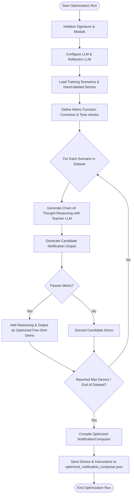
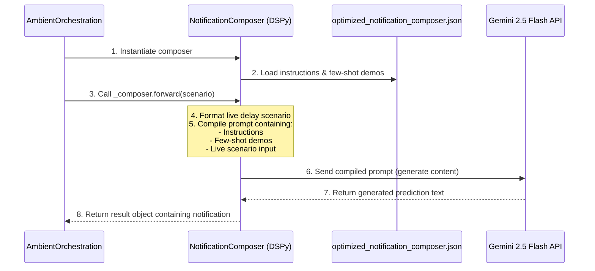
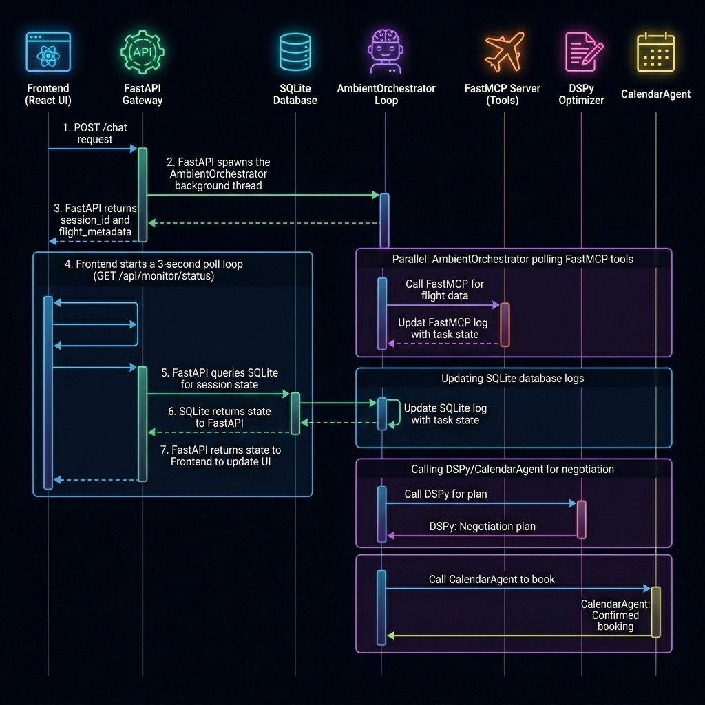
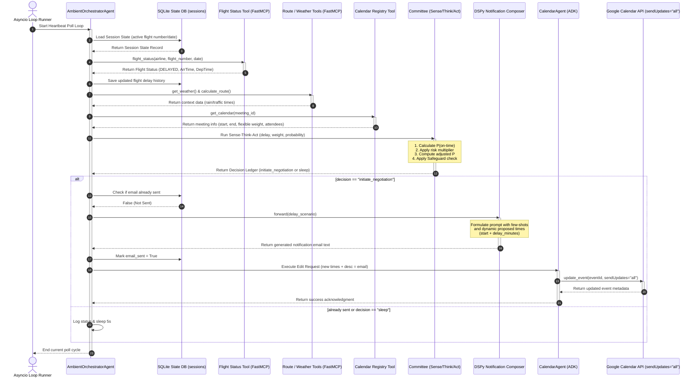

# DSPy Optimization & Inference: Mermaid Diagrams

## 1. High-Level Architecture Overview
```mermaid
flowchart TD
    subgraph Phase 1: Optimization (dspyoptimizer.py)
        A[Define Signature & Module] --> B[Load Dataset & Metric]
        B --> C[BootstrapFewShot Teleprompter]
        C --> D[Run Optimization with Teacher LLM]
        D --> E[Save compiled state to optimized_notification_composer.json]
    end

    subgraph Phase 2: Inference (AmbientOrchestration.py)
        E --> F[Load JSON State into Module]
        F --> G[Construct Prompt with Demos + Live Scenario]
        G --> H[Query Active LM: Gemini 2.5 Flash]
        H --> I[Extract & Parse notification field]
    end
```

---

## 2. Compilation and Optimization Loop


---

## 3. Runtime Inference Sequence Diagram


## 4. Full Ambient Orchestrator Working Workflow Sequence Diagram
This diagram shows the complete Sensing, Thinking, and Acting execution cycle of the `AmbientOrchestratorAgent`, including SQLite session database persistence, FastMCP tool integration, committee decision overrides, DSPy notification generation, and the Google Calendar notification update dispatch.

### Visual Sequence Diagram


### Text-Based Sequence Diagram
```text
 System          Orchestrator      DB       MCP Tools      Committee     DSPy     CalendarAgent  Calendar API
   │                  │             │           │              │          │             │              │
   │─── 1. Poll ─────►│             │           │              │          │             │              │
   │                  │── 2. Load ─►│           │              │          │             │              │
   │                  │◄── State ───│           │              │          │             │              │
   │                  │                         │              │          │             │              │
   │                  │─── 3. Flight Status ───►│              │          │             │              │
   │                  │◄── (Delayed, 90 mins) ──│              │          │             │              │
   │                  │                         │              │          │             │              │
   │                  │─── 4. Save Delay ──────►│              │          │             │              │
   │                  │                         │              │          │             │              │
   │                  │─── 5. Weather & Route ─►│              │          │             │              │
   │                  │◄── Context Data ────────│              │          │             │              │
   │                  │                         │              │          │             │              │
   │                  │─── 6. Calendar Registry►│              │          │             │              │
   │                  │◄── Meeting Details ─────│              │          │             │              │
   │                  │                                        │          │             │              │
   │                  │─────────── 7. Run Committee ──────────►│          │             │              │
   │                  │◄────────── (Negotiate Ledger) ─────────│          │             │              │
   │                  │                                                   │             │              │
   │                  │─────────── 8. Generate Email ────────────────────►│             │              │
   │                  │◄────────── (Alternative Times) ───────────────────│             │              │
   │                  │                                                                 │              │
   │                  │───────────────────── 9. Execute Edit Reschedule ───────────────►│              │
   │                  │                                                                 │── 10. Update►│
   │                  │                                                                 │  (Guests)    │
```

### Mermaid Source Code


