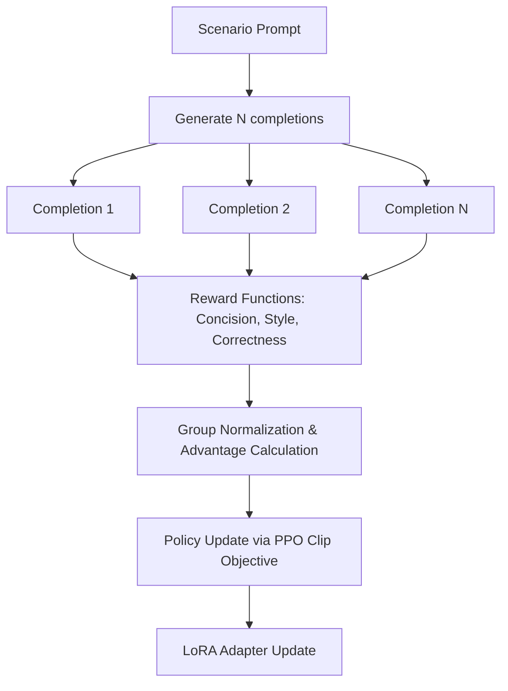

# GulliverTravels: RLVR Training Guide (GRPO)

This guide documents the Reinforcement Learning with Verifiable Rewards (RLVR) pipeline implemented in `backend/rlvr_training.py` to train local language models (such as Microsoft Phi-3 or Google Gemma 2) on travel rescheduling notification tasks.

The pipeline utilizes **Group Relative Policy Optimization (GRPO)**—the same algorithm used by DeepSeek-R1—to optimize generation outputs based on strict, verifiable constraints without the memory overhead of a separate critic model.

---

## 🏗️ 1. Why GRPO?

Traditional Reinforcement Learning from Human Feedback (RLHF) methods like PPO require instantiating a separate **Critic (Value) Model** alongside the **Actor (Policy) Model**, which doubles the VRAM requirements.

**GRPO** optimizes the policy by:
1. Generating a group of $N$ completions ($N = 4$ to $8$) for a single prompt.
2. Evaluating each completion through a set of reward functions.
3. Normalizing the rewards within the group (calculating relative advantage).
4. Updating the model based on these relative scores.

This eliminates the critic network entirely, saving roughly **50% of VRAM** and allowing fine-tuning to run on consumer hardware or single-GPU cloud environments.



---

## 🎯 2. Reward Functions & Constraints

The trainer enforces three reward functions directly aligned with the capstone specifications, outputting a value in the range $[0.0, 1.0]$:

### 📏 A. Concision Reward (`reward_len`)
Enforces the maximum limit of **120 words**:
* **Target met (≤ 120 words)**: Receives a perfect score of `1.0`.
* **Target missed (> 120 words)**: Deducts `0.05` points for every word over the limit, scaling down to `0.0`.

### 🎭 B. Formality / Tone Reward (`reward_style`)
Aligns the message formality with meeting weight:
* Checks the frequency of formal keywords (e.g., *sincerely*, *apologies*, *regards*) versus casual words (e.g., *hey*, *sorry about*, *heads up*).
* Matches the message structure against the meeting formality requirement (`is_formal` matches if weight $\ge 0.6$).
* Returns `1.0` for a correct match, `0.5` for borderline cases (weight $\approx 0.5$), and `0.0` for a mismatch.

### 🔍 C. Structural Correctness Reward (`reward_correct`)
Combines rule-based checks with semantic similarity:
1. **Rule-Based Sub-scores (0.25 points each)**:
   * **Delay Mentioned**: Verifies the exact delay number (in minutes) is written.
   * **Attendees Named**: Verifies at least one attendee name from the calendar is present.
   * **Times Proposed**: Verifies at least one proposed rescheduling slot is listed.
   * **Fallback Option**: Verifies presence of virtual/reschedule fallback keywords (e.g., *dial in*, *zoom*, *call*).
2. **Semantic Similarity Bonus (0.0 to 0.2 points)**:
   * Uses `sentence-transformers/all-MiniLM-L6-v2` to compute the cosine similarity between the input scenario facts and the generated text.
   * Ensures the model doesn't just list keywords but drafts a coherent notification about the actual scenario.

---

## 🛠️ 3. Environment & Setup

To run training, ensure your local environment contains the necessary dependencies:

```bash
pip install torch transformers peft trl accelerate bitsandbytes
pip install sentence-transformers python-dotenv datasets
```

For GPU-based training, `accelerate` should be configured for your hardware environment.

---

## 🚀 4. Execution Playbook

### 🧪 Step 1: Execute the Dry-Run Unit Test
You can test the logic of all three reward functions without loading large models or utilizing a GPU by running the script with the `--dry-run` flag:

```bash
python backend/rlvr_training.py --dry-run
```

This runs a mock evaluation on a set of pre-written completions and outputs a score matrix:
```text
Label                           r_len  r_sty  r_cor  words
────────────────────────────────────────────────────────────
GOOD (all criteria)             1.000  1.000  1.000     45
VAGUE (missing key info)        1.000  0.000  0.302     13
OVER LIMIT (too long)           0.500  1.000  0.580    135
```

### 🏋️ Step 2: Launch GRPO Training
Run the training loop for a specified model registry key. Standard registration options are `"phi3"`, `"gemma2"`, and `"smol"` (a 135M parameter model ideal for fast testing).

```bash
# Train Phi-3-mini (default)
PYTHONPATH=. python backend/rlvr_training.py --model phi3 --epochs 8

# Train Gemma-2-9B (for higher quality reasoning)
PYTHONPATH=. python backend/rlvr_training.py --model gemma2 --epochs 8
```

### 📊 Step 3: Run Evaluation Checkpoints
To load a compiled model checkpoint and run a benchmark score against a held-out dataset of 30 unseen scenarios:

```bash
PYTHONPATH=. python backend/rlvr_training.py --eval-only --checkpoint ./ambient_model_out
```

**Target:** The model should achieve a composite evaluation score of **$\ge 0.80$** (equivalent to a 4.0/5.0 manual score rating).

---

## 💡 5. Local VRAM Optimization Tips

If you are training on a single GPU or a local Apple Silicon Mac (e.g. M1/M2/M3 Max):
1. **Reduce Group Size**: The default group size in the config is set to `num_generations = 4` (reduced from the paper's standard `8` or `16`) to fit generations in memory.
2. **Gradient Accumulation**: We use `gradient_accumulation_steps = 4` with a batch size of `1` to simulate a larger batch size without increasing peak VRAM.
3. **LoRA Target Modules**: The model targets `all-linear` projection layers for LoRA adaptation to ensure high flexibility while training less than 2% of the base model parameters.
